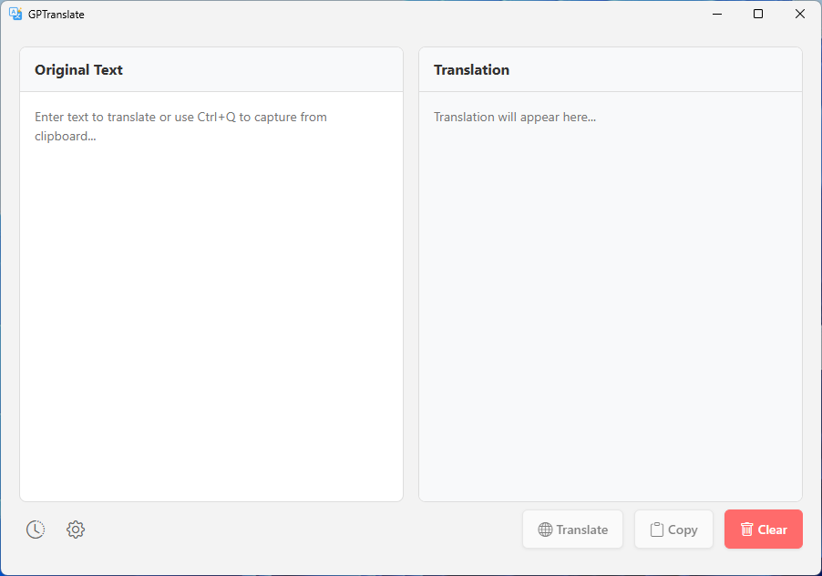
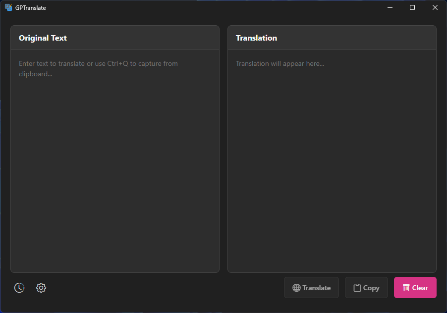
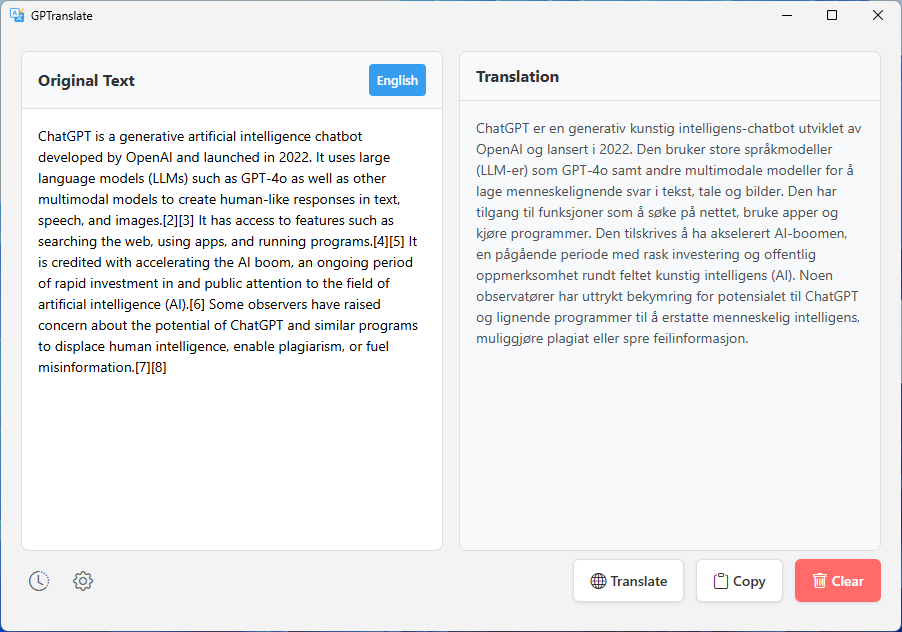
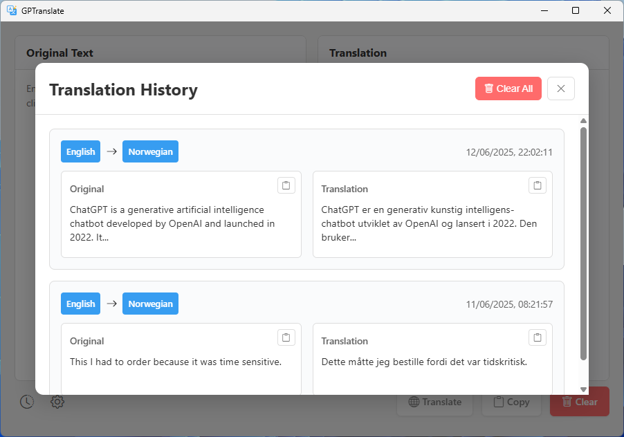
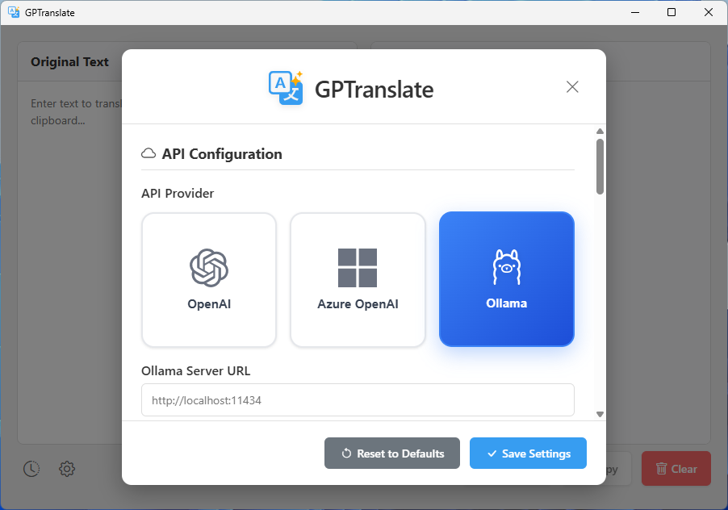

#  GPTranslate

A fast, modern **AI powered** desktop translation application built with Rust and Tauri that provides instant translation between multiple languages with global hotkey support, system tray integration, and a beautiful user interface. Supports OpenAI, Azure OpenAI, and Ollama APIs for high-quality translations with minimal latency and cost.

**Completely FREE** when used with Ollama for local AI-powered translations - no API costs, no internet required, and complete privacy!

**Note:** This project has been tested on Windows 11 only. It may work on other platforms, but is not guaranteed. If you would like to help with testing on macOS or Linux, please open an issue.

## 📋 Table of Contents

### For End Users

- [📸 Screenshots](#-screenshots)
- [✨ Features](#-features)
- [💰 Cost Analysis](#-cost-analysis)
- [⬇️ Installation](#️-installation)
- [🚀 Quick Start Guide](#-quick-start-guide)
- [🎯 Usage](#-usage)

### For Developers

- [🔨 Development Commands](#-development-commands)
- [📦 Building for Distribution](#-building-for-distribution)

### General

- [📄 License](#-license)
- [🙏 Acknowledgments](#-acknowledgments)
- [📧 Support](#-support)

---

## 📸 Screenshots

### Main Interface

**Light Theme**


**Dark Theme**


### Features Overview

**Translation in Action**


**History Management**


**Settings Panel**


## ✨ Features

### Core Translation

- **Intelligent Language Detection**: Automatically detects the source language from most supported languages
- **Multi-language Translation**: Seamless translation between dozens of languages with configurable target language
- **Real-time Translation**: Debounced translation as you type (500ms delay)
- **Multiple AI Providers**: Support for OpenAI, Azure OpenAI, and Ollama (local) APIs
- **Free Local Translation**: Use Ollama for completely free, offline translations with local AI models
- **Custom Prompts**: Configurable translation prompts with variable support
- **Alternative Target Language**: Fallback when source equals target language

### User Interface

- **Modern UI**: Clean, responsive interface with two-panel layout
- **Theme Support**: Auto, light, and dark themes with system detection
- **Keyboard Shortcuts**:
  - **Configurable Global Hotkey** (default `Ctrl+Alt+C`):
    - When app is **not focused**: Clipboard capture and translation
    - When app **is focused**: Reset detected language
  - `Ctrl+C`: Copy translated text when app is focused
- **Responsive Design**: Scales beautifully across different window sizes

### System Integration

- **System Tray**: Runs quietly in background with context menu
- **Global Hotkey**: Capture clipboard content from anywhere
- **Auto-start**: Optional startup with Windows
- **Single Instance**: Prevents multiple app instances
- **Clipboard Integration**: Seamless read/write clipboard operations

### Data Management

- **Translation History**: Persistent history
- **Configuration**: JSON-based settings in `~/.gptranslate/config.json`
- **Settings GUI**: User-friendly configuration interface

## Planned Features

- Model management, allowing users to select and switch between different models.
- Better history management, including search and filtering.

## 💰 Cost Analysis

GPTranslate offers flexible pricing options from completely **FREE¹** with Ollama to extremely cost-effective with OpenAI's `gpt-4.1-nano` model:

### Free Option: Ollama¹

**Complete cost breakdown**: **$0.00** - Forever!

- ✅ **No API costs** - Run completely offline
- ✅ **No internet required** - Perfect for private/secure environments  
- ✅ **Complete privacy** - Your data never leaves your machine
- ✅ **Unlimited usage** - Translate as much as you want
- ✅ **Professional quality** - Modern AI models like Llama, Mistral, etc.

### Cloud-based Translation Costs (per request)

| Model                          | Input Cost      | Output Cost      | Total per Paragraph\* |
| ------------------------------ | --------------- | ---------------- | --------------------- |
| **gpt-4.1-nano** (recommended) | $0.10/1M tokens | $0.40/1M tokens  | **~$0.00005**         |
| gpt-4.1-mini                   | $0.40/1M tokens | $1.60/1M tokens  | ~$0.00019             |
| gpt-4o-mini                    | $0.15/1M tokens | $0.60/1M tokens  | ~$0.000071            |
| gpt-4.1                        | $2.00/1M tokens | $8.00/1M tokens  | ~$0.00095             |
| gpt-4o                         | $2.50/1M tokens | $10.00/1M tokens | ~$0.00119             |

\*Based on ~100 words (130 tokens input + output)

#### Azure Models and Prices

Azure OpenAI offers comparable pricing, which you can check in detail on the [official Azure AI Foundry pricing page](https://azure.microsoft.com/en-us/pricing/details/ai-foundry/). The `gpt-4.1-nano` model is a great choice due to its balance of low cost and high quality. You might also consider using the `model-router`, which automatically picks the most suitable model for your request. However, keep in mind that it won't always choose the cheapest option. For translation tasks specifically, specialised models like `mistral-small` or `mistral-small-2503` are worth exploring, as they are likely to deliver exceptional results.

### Real-World Usage Examples

#### With Ollama (Free¹)

- **Any amount of translation**: $0.00 forever
- **No limits**: Translate entire books, documents, websites
- **Private & secure**: Perfect for sensitive content

#### With Cloud APIs

- **Single paragraph**: Less than $0.0001 with gpt-4.1-nano
- **100 translations/day**: ~$0.005 ($1.50/month)
- **1000 translations/day**: ~$0.05 ($15/month)

---
¹ Requires expensive GPU for optimal performance 😒

The `gpt-4.1-nano` model provides excellent translation quality at virtually no cost for typical usage patterns, making GPTranslate highly economical for both personal and professional use.

## ⬇️ Installation

### Download Windows Installer

You can download the latest Windows installer from the [Releases](https://github.com/philberndt/GPTranslate/releases) page.

### Install with WinGet

```bash
winget install PhilBerndt.GPTranslate
```

## 🚀 Quick Start Guide

### Prerequisites for API Usage

You'll need an API key from one of these providers:

- **Ollama**: [Ollama](https://ollama.ai) for local, offline translation (no API key required)
- **OpenAI**: Get API key from [OpenAI Platform](https://platform.openai.com/api-keys)
- **Azure OpenAI**: Create resource in [Azure Portal](https://portal.azure.com/)

### Getting Started

1. **Install GPTranslate** using one of the methods above
2. **Launch the application** from Start Menu or desktop shortcut
3. **Configure your API**:
   - Click the Settings button (gear icon)
   - Select your preferred provider (Ollama for local, OpenAI or Azure OpenAI for cloud)
   - Enter your API credentials
4. **Start translating**:
   - Type text in the left panel
   - Translation appears automatically in the right panel
   - Use `Ctrl+Alt+C` globally to translate clipboard content

⚠️ **Note:** The API Keys and Endpoint are stored in plain text. Ensure your system is secure.

### API Setup

#### OpenAI

1. Get an API key from [OpenAI Platform](https://platform.openai.com/api-keys)
2. In Settings, select "OpenAI" as provider
3. Enter your API key and preferred model

#### Azure OpenAI

1. Create an Azure OpenAI resource
2. Deploy a model (recommend `gpt-4.1-nano`), as it is super cheap and fast.
3. In Settings, select "Azure OpenAI" as provider
4. Enter your endpoint and API key

#### Ollama

1. **Install Ollama**: Download from [ollama.ai](https://ollama.ai) or use `winget install ollama.ollama`
   - **Note**: Requires a GPU for optimal performance
2. **Pull a model**: Run `ollama pull mistral-small` (or any preferred model)
3. **Start Ollama**: The service should start automatically
4. **Configure GPTranslate**:
   - In Settings, select "Ollama" as provider
   - Set the server URL (default: `http://localhost:11434`)
   - Choose your downloaded model name

## 🎯 Usage

### Basic Translation

1. **Launch**: Click the system tray icon or use the global hotkey
2. **Type or Paste**: Enter text in the left panel
3. **Auto-translate**: Translation appears in the right panel
4. **Copy**: Click Copy button or press `Ctrl+C` when app is focused

### Global Hotkey Workflow

1. **Copy text anywhere** with `Ctrl+C`
2. **Press global hotkey** (`Ctrl+Alt+C`)
3. **View translation** in app window
4. **Copy result** `Ctrl+C` or `Copy` button to copy to clipboard

### Keyboard Shortcuts

- **Configurable Global Hotkey** (default `Ctrl+Alt+C`):
  - **Always**: Reset detected language first
  - When app is **not focused**: Also capture clipboard and translate
  - When app **is focused**: Only reset detected language
- `Ctrl+C`: Copy translated text (when app focused)
- `Esc`: Close settings/history dialogs

### Custom Translation Prompts

Use these variables in your prompts:

- `{detected_language}`: Source language
- `{target_language}`: Target language

Example:

```text
Translate from {detected_language} to {target_language}.
Preserve the original tone and cultural context.
```

---

## 👨‍💻 For Developers

### Prerequisites

- **Rust**: 1.87+ with stable toolchain
- **Node.js**: 22+ with npm
- **Visual Studio Build Tools**: 2022 (Windows)
- **WebView2**: Runtime (usually pre-installed on Windows 11)

### Installation

1. **Clone the repository**:

   ```bash
   git clone https://github.com/philberndt/gptranslate.git
   cd gptranslate
   ```

2. **Install dependencies**:

   ```bash
   npm install
   ```

3. **Set up your API configuration**:

   - Run the app once to create the config file
   - Add your OpenAI or Azure OpenAI credentials in Settings

4. **Run in development**:

   ```bash
   npm run tauri dev
   ```

## 🔨 Development Commands

```bash
# Development server with hot reload
npm run tauri dev

# Build for production
npm run tauri build

# Run frontend only
npm run dev

# Type check
npm run check

# Lint code
npm run lint
```

## 📦 Building for Distribution

### Windows Installer

```bash
# Build MSI and NSIS installers
npm run tauri build
```

Installers are created in `src-tauri/target/release/bundle/`

## 📄 License

This project is licensed under the MIT License - see the [LICENSE](LICENSE) file for details.

## 🙏 Acknowledgments

- **Icons**: [Bootstrap Icons](https://icons.getbootstrap.com/)
- **Framework**: Built with [Tauri](https://tauri.app/) and [SvelteKit](https://kit.svelte.dev/)

## 📧 Support

- **Issues**: [GitHub Issues](https://github.com/philberndt/gptranslate/issues)

---

**Technology Stack**: Tauri 2.5+ • Rust • SvelteKit • Vite • TypeScript
